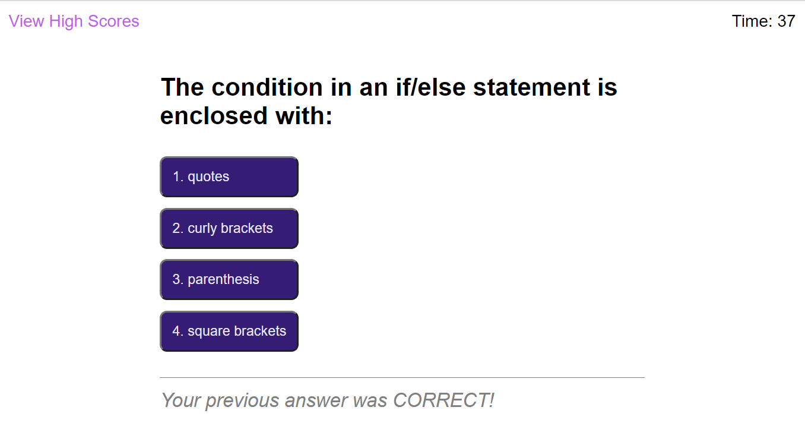

# Code Quiz
This fourth challenge for the Coding Bootcamp is to use javascript present a timed quiz about javascript (how very meta!). This challenge was started from scratch.

[Requirements](#requirements)

[What I Learned](#whatILearned)

[Code Quiz Screenshot](#webImage)

[Code Quiz URL](#projectURL)

[Contact Me](#contactMe)

---

## Requirements
<ul>
<li> When the user clicks the start button, a timer starts and the user is presented with a question</li>
<li> When the user selects an answer to the question</li>
<ul>
<li> They are presented with another question</li>
<li> They are told if they answered the previous question correctly or not</li>
<li> If they answered incorrectly, time is deducted from the timer</li>
</ul>
<li> When all questions are answered or the timer reaches 0, the game is over</li>
<li> When the game is over, the user can save their initials and score</li>
<ul><li> NOTE: I changed this so that if the game is over because the time ran out, the user's score is not saved.</li></ul>
<li> NOTE About Answer Feedback: The mockup shows the feedback as "Wrong!" or "Correct!" below the answers. It looks like the feedback applies to the user's response to the question currently displayed, but it's actually to the previous question. I changed the wording to be "Your previous answer was Correct/Wrong!" (as appropriate).</li>
<li> NOTE About the "Go Back" button: The "Go Back" button on the high scores screen in the mock up is ambiguous - does it "go back" to the last question? Or does it go back to the start of the quiz? Or does it go back to the initial greeting? I've made it go back to the initial greeting, and I've changed the name to "Start Over".</li>
<li> NOTE About the quiz questions: I used the questions from the mockup and then added a few more from

[W3 Schools Quiz](https://www.w3schools.com/js/js_quiz.asp)</li>
</ul>

---

## I learned...
* how to use timers
* how to use localStorage for data persistence on a given device
* how to use javascript to select and dynamically generate HTML elements and content
* how to handle events such as key presses and mouse 
clicks, including using event-driven functions
* how to research Web API docmentation

---

## Code Quiz Screenshot

---

## Code Quiz URL

[Code Quiz URL](https://bjackels5.github.io/code-quiz/)

---

## Contact Me
You can reach me, Brenda Jackels, at bjackels5@gmail.com.
